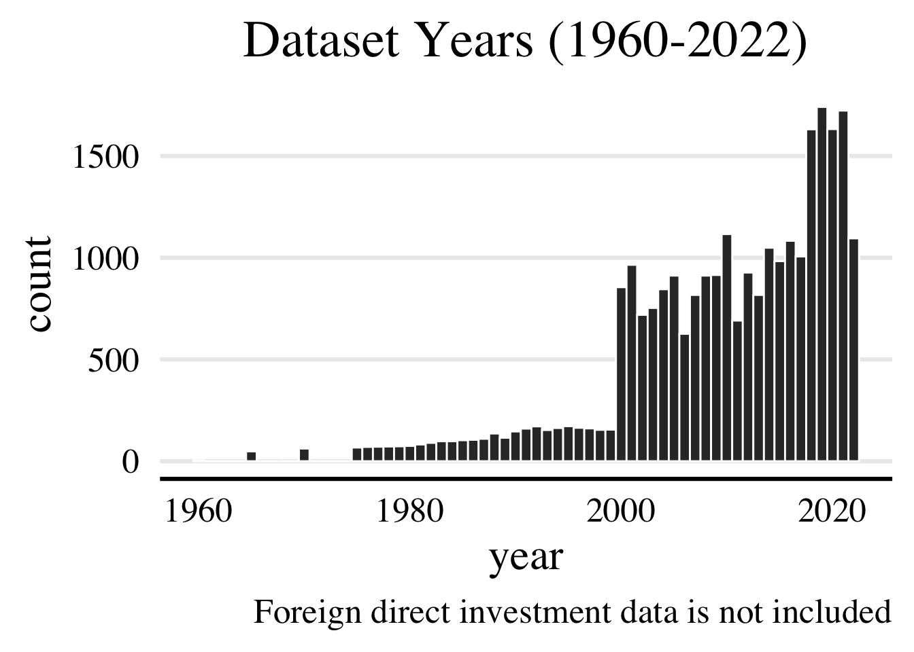
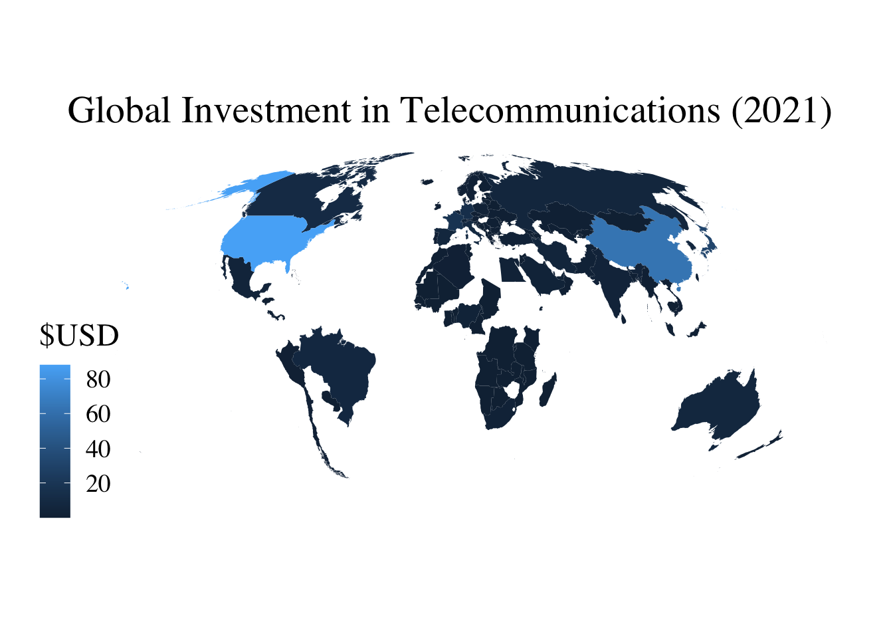

The rise of 5G technologies and continuing expansion of undersea cable networks is propelling the telecommunications industry through the 21st century. While The telecommunications industry is vital for maintaining the integrity of the global economy, societal functioning, and security, there are unequal gaps in telecommunications connectiveness and investment globally. Additionally, the industry itself is a high-debt sector that appears to be facing decreasing revenues and returns. Assessing global telecommunications investment data may provide insight that can support policymakers in better understanding the current telecommunications landscape and implementing high-impact infrastructural investments.

Using data from the ITU and World Bank, this study investigates the relationships between annual investment in telecommunications, total gdp and gdp-per-capita, competition within a country's telecommunications industry, and ease-of-business. Although quite flawed, these variables very roughly stand in for countries' economic power, industry concentration, and business friendliness. Specifically, I measure:

-   How does the annual investment in telecommunications vary across different countries?"

-   Is there any correlation between the annual investment in telecommunications and factors such as economic strength, level of competition, or ease of business?

-   Do these variances and differences apply to annual foreign investment as well?

# Data and Methodology

The '*telecom.csv*' dataset contains economic data from 1960-2022 across 218 countries, 18 sub-industries, and 11 ease of business indicators. Data regarding [annual investment in telecommunication services](https://datahub.itu.int/data/?i=372), [annual foreign investment](https://datahub.itu.int/data/?i=10), and [level of competition](https://datahub.itu.int/data/?i=100045) were taken from the [ITU's "DataHub](https://datahub.itu.int/%22). Historical data on ease of business were taken from The World Bank's ['Doing Business'](https://archive.doingbusiness.org/en/data) archive. Lastly, data on economic strength were taken from the IMF's public datasets on ([GDP, current prices](https://www.imf.org/external/datamapper/NGDPD@WEO/OEMDC/ADVEC/WEOWORLD%5D) and [GDP per capita, current prices](https://www.imf.org/external/datamapper/NGDPDPC@WEO/OEMDC/ADVEC/WEOWORLD), respectively.

