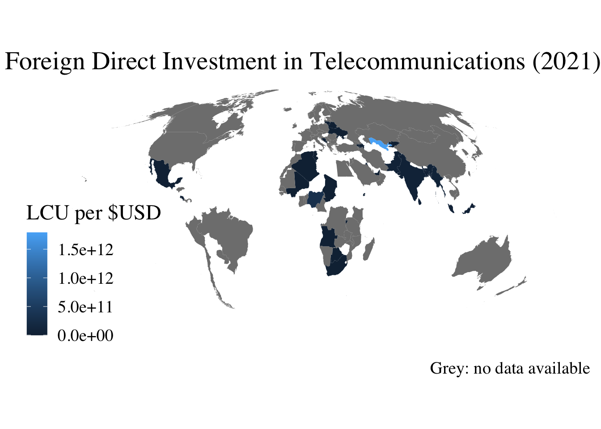
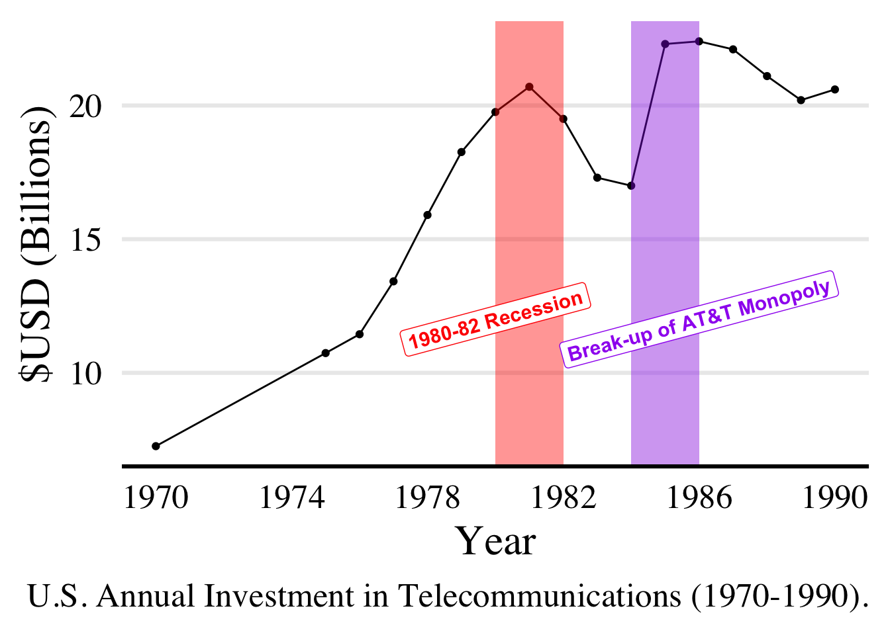

# Introduction

-   While the rise of 5G technologies and expansion of undersea cable networks propels the telecommunications industry through the 21st century, there are unequal gaps in globally connectivity and investment. Policymakers require data to understand the current telecommunications landscape and implement high-impact infrastructure investments.

-   Using data from the ITU and World Bank, I assess correlations between annual investment in telecommunications, total gdp and gdp-per-capita, industry competition, and ease-of-business. Although flawed, these metrics may provide interesting insight. Specifically, I assess:

      1.   Global variance in domestic and foreign annual telecommunications investment.

      2.   Correlation between domestic and foreign annual investment and factors like economic strength, level of competition, and ease of business.

# Data and Methodology

-    The '*telecom.csv*' dataset covers 218 countries, 18 sub-industries, and 11 ease of business indicators.
-    Data for [annual investment in telecommunication services](https://datahub.itu.int/data/?i=372), [annual foreign investment](https://datahub.itu.int/data/?i=10), and [level of competition](https://datahub.itu.int/data/?i=100045) were taken from the [ITU's "DataHub](https://datahub.itu.int/%22) ([ITU Data Handbook](https://www.itu.int/en/ITU-D/Statistics/Pages/publications/handbook.aspx)).
-   Investment data captures expenditure associated with acquiring the ownership of property for all operators offering services in the country from 1960-2022 (includes fixed, mobile, and Internet  services). 
-   Foreign investment had only 500 observations; I didn't use it.
-   Competition level data covers 2000 to 2022. Unclear where ITU found their competition_level data...
-   Data on GDP & GDP-per-capita were taken from the IMF's public datasets on ([GDP, current prices](https://www.imf.org/external/datamapper/NGDPD@WEO/OEMDC/ADVEC/WEOWORLD%5D) and [GDP per capita, current prices](https://www.imf.org/external/datamapper/NGDPDPC@WEO/OEMDC/ADVEC/WEOWORLD), respectively, and cover the years 1980-2022.
-   Lastly, historical data on ease of business were taken from The World Bank's ['Doing Business'](https://archive.doingbusiness.org/en/data) archive ([Methodology](https://openknowledge.worldbank.org/server/api/core/bitstreams/d7d4cdc9-240c-53d8-b247-f0c0f59b0bcf/content)). 
-   Ease of business indicators tended to overrepresent urban areas and limited liability companies. Experts made some limited assumptions regarding 'measures of time' data and businesses' access to information.


Table: (\#tab:unnamed-chunk-3)Global Telecom Competition (2021)

|Level of Competition | Freq |  Percent  |
|:--------------------|:----:|:---------:|
|Full competition     | 1245 | 86.338419 |
|Partial competition  | 119  | 8.252427  |
|Monopoly             |  78  | 5.409154  |







# Results


```{=html}
<!DOCTYPE html> 
<html lang="en">
  <head>
    <meta charset="UTF-8">
    <meta name="viewport" content="width=device-width, initial-scale=1.0">
    <title>tinytable_s2ktp4tvow877p2uiuk3</title>
    <style>
.table td.tinytable_css_fyd23e350lxuod9yl1ef, .table th.tinytable_css_fyd23e350lxuod9yl1ef {    border-bottom: solid 0.1em #d3d8dc; }
.table td.tinytable_css_omaqn4ipa5og2j35cnei, .table th.tinytable_css_omaqn4ipa5og2j35cnei {    text-align: left; }
.table td.tinytable_css_f3qnf6im7fa6iu70l76m, .table th.tinytable_css_f3qnf6im7fa6iu70l76m {    text-align: center; }
.table td.tinytable_css_dqv9uymvg3a77ag988o8, .table th.tinytable_css_dqv9uymvg3a77ag988o8 {    text-align: center; }
.table td.tinytable_css_f011az68ny12nvq785hk, .table th.tinytable_css_f011az68ny12nvq785hk {    text-align: center; }
.table td.tinytable_css_hzbebh4wln0bffxrooii, .table th.tinytable_css_hzbebh4wln0bffxrooii {    text-align: center; }
.table td.tinytable_css_16tu3u4938vvbweupaxi, .table th.tinytable_css_16tu3u4938vvbweupaxi {    border-bottom: solid 0.05em black; }
    </style>
    <script src="https://polyfill.io/v3/polyfill.min.js?features=es6"></script>
    <script id="MathJax-script" async src="https://cdn.jsdelivr.net/npm/mathjax@3/es5/tex-mml-chtml.js"></script>
    <script>
    MathJax = {
      tex: {
        inlineMath: [['$', '$'], ['\\(', '\\)']]
      },
      svg: {
        fontCache: 'global'
      }
    };
    </script>
  </head>

  <body>
    <div class="container">
      <table class="table table-borderless" id="tinytable_s2ktp4tvow877p2uiuk3" style="width: auto; margin-left: auto; margin-right: auto;" data-quarto-disable-processing='true'>
        <thead>
        <caption>DV: Annual (Domestic) Investment in Telecommunications</caption>
              <tr>
                <th scope="col"> </th>
                <th scope="col">Competition Level</th>
                <th scope="col">+ Total GDP</th>
                <th scope="col">+ GDP-per-Cap</th>
                <th scope="col">+ Ease of Business</th>
              </tr>
        </thead>
        <tfoot><tr><td colspan='5'>*** p < 0.01</td></tr></tfoot>
        <tbody>
                <tr>
                  <td>competition_levelMonopoly           </td>
                  <td>-524.03</td>
                  <td>-186.36</td>
                  <td>-198.57</td>
                  <td>199.68</td>
                </tr>
                <tr>
                  <td>competition_levelPartial competition</td>
                  <td>36.71  </td>
                  <td>551.81 </td>
                  <td>549.04 </td>
                  <td>780.34</td>
                </tr>
                <tr>
                  <td>gdp_total_bil                       </td>
                  <td>       </td>
                  <td>2.18***</td>
                  <td>2.19***</td>
                  <td>3.15  </td>
                </tr>
                <tr>
                  <td>gdp_per_cap                         </td>
                  <td>       </td>
                  <td>       </td>
                  <td>0.00   </td>
                  <td>-0.01 </td>
                </tr>
                <tr>
                  <td>startbuscapital                     </td>
                  <td>       </td>
                  <td>       </td>
                  <td>       </td>
                  <td>-1.29 </td>
                </tr>
                <tr>
                  <td>permit_time                         </td>
                  <td>       </td>
                  <td>       </td>
                  <td>       </td>
                  <td>11.85 </td>
                </tr>
                <tr>
                  <td>register_time                       </td>
                  <td>       </td>
                  <td>       </td>
                  <td>       </td>
                  <td>-6.79 </td>
                </tr>
                <tr>
                  <td>register_cost                       </td>
                  <td>       </td>
                  <td>       </td>
                  <td>       </td>
                  <td>47.65 </td>
                </tr>
                <tr>
                  <td>contracts_time                      </td>
                  <td>       </td>
                  <td>       </td>
                  <td>       </td>
                  <td>0.86  </td>
                </tr>
                <tr>
                  <td>contracts_cost                      </td>
                  <td>       </td>
                  <td>       </td>
                  <td>       </td>
                  <td>13.54 </td>
                </tr>
                <tr>
                  <td>Num.Obs.                            </td>
                  <td>20673  </td>
                  <td>19773  </td>
                  <td>19773  </td>
                  <td>10476 </td>
                </tr>
        </tbody>
      </table>
    </div>

    <script>
      function styleCell_tinytable_9zc3ja5d7hjkwckd0jnz(i, j, css_id) {
        var table = document.getElementById("tinytable_s2ktp4tvow877p2uiuk3");
        table.rows[i].cells[j].classList.add(css_id);
      }
      function insertSpanRow(i, colspan, content) {
        var table = document.getElementById('tinytable_s2ktp4tvow877p2uiuk3');
        var newRow = table.insertRow(i);
        var newCell = newRow.insertCell(0);
        newCell.setAttribute("colspan", colspan);
        // newCell.innerText = content;
        // this may be unsafe, but innerText does not interpret <br>
        newCell.innerHTML = content;
      }
      function spanCell_tinytable_9zc3ja5d7hjkwckd0jnz(i, j, rowspan, colspan) {
        var table = document.getElementById("tinytable_s2ktp4tvow877p2uiuk3");
        const targetRow = table.rows[i];
        const targetCell = targetRow.cells[j];
        for (let r = 0; r < rowspan; r++) {
          // Only start deleting cells to the right for the first row (r == 0)
          if (r === 0) {
            // Delete cells to the right of the target cell in the first row
            for (let c = colspan - 1; c > 0; c--) {
              if (table.rows[i + r].cells[j + c]) {
                table.rows[i + r].deleteCell(j + c);
              }
            }
          }
          // For rows below the first, delete starting from the target column
          if (r > 0) {
            for (let c = colspan - 1; c >= 0; c--) {
              if (table.rows[i + r] && table.rows[i + r].cells[j]) {
                table.rows[i + r].deleteCell(j);
              }
            }
          }
        }
        // Set rowspan and colspan of the target cell
        targetCell.rowSpan = rowspan;
        targetCell.colSpan = colspan;
      }

window.addEventListener('load', function () { styleCell_tinytable_9zc3ja5d7hjkwckd0jnz(0, 0, 'tinytable_css_fyd23e350lxuod9yl1ef') })
window.addEventListener('load', function () { styleCell_tinytable_9zc3ja5d7hjkwckd0jnz(0, 1, 'tinytable_css_fyd23e350lxuod9yl1ef') })
window.addEventListener('load', function () { styleCell_tinytable_9zc3ja5d7hjkwckd0jnz(0, 2, 'tinytable_css_fyd23e350lxuod9yl1ef') })
window.addEventListener('load', function () { styleCell_tinytable_9zc3ja5d7hjkwckd0jnz(0, 3, 'tinytable_css_fyd23e350lxuod9yl1ef') })
window.addEventListener('load', function () { styleCell_tinytable_9zc3ja5d7hjkwckd0jnz(0, 4, 'tinytable_css_fyd23e350lxuod9yl1ef') })
window.addEventListener('load', function () { styleCell_tinytable_9zc3ja5d7hjkwckd0jnz(0, 0, 'tinytable_css_omaqn4ipa5og2j35cnei') })
window.addEventListener('load', function () { styleCell_tinytable_9zc3ja5d7hjkwckd0jnz(1, 0, 'tinytable_css_omaqn4ipa5og2j35cnei') })
window.addEventListener('load', function () { styleCell_tinytable_9zc3ja5d7hjkwckd0jnz(2, 0, 'tinytable_css_omaqn4ipa5og2j35cnei') })
window.addEventListener('load', function () { styleCell_tinytable_9zc3ja5d7hjkwckd0jnz(3, 0, 'tinytable_css_omaqn4ipa5og2j35cnei') })
window.addEventListener('load', function () { styleCell_tinytable_9zc3ja5d7hjkwckd0jnz(4, 0, 'tinytable_css_omaqn4ipa5og2j35cnei') })
window.addEventListener('load', function () { styleCell_tinytable_9zc3ja5d7hjkwckd0jnz(5, 0, 'tinytable_css_omaqn4ipa5og2j35cnei') })
window.addEventListener('load', function () { styleCell_tinytable_9zc3ja5d7hjkwckd0jnz(6, 0, 'tinytable_css_omaqn4ipa5og2j35cnei') })
window.addEventListener('load', function () { styleCell_tinytable_9zc3ja5d7hjkwckd0jnz(7, 0, 'tinytable_css_omaqn4ipa5og2j35cnei') })
window.addEventListener('load', function () { styleCell_tinytable_9zc3ja5d7hjkwckd0jnz(8, 0, 'tinytable_css_omaqn4ipa5og2j35cnei') })
window.addEventListener('load', function () { styleCell_tinytable_9zc3ja5d7hjkwckd0jnz(9, 0, 'tinytable_css_omaqn4ipa5og2j35cnei') })
window.addEventListener('load', function () { styleCell_tinytable_9zc3ja5d7hjkwckd0jnz(10, 0, 'tinytable_css_omaqn4ipa5og2j35cnei') })
window.addEventListener('load', function () { styleCell_tinytable_9zc3ja5d7hjkwckd0jnz(11, 0, 'tinytable_css_omaqn4ipa5og2j35cnei') })
window.addEventListener('load', function () { styleCell_tinytable_9zc3ja5d7hjkwckd0jnz(0, 1, 'tinytable_css_f3qnf6im7fa6iu70l76m') })
window.addEventListener('load', function () { styleCell_tinytable_9zc3ja5d7hjkwckd0jnz(1, 1, 'tinytable_css_f3qnf6im7fa6iu70l76m') })
window.addEventListener('load', function () { styleCell_tinytable_9zc3ja5d7hjkwckd0jnz(2, 1, 'tinytable_css_f3qnf6im7fa6iu70l76m') })
window.addEventListener('load', function () { styleCell_tinytable_9zc3ja5d7hjkwckd0jnz(3, 1, 'tinytable_css_f3qnf6im7fa6iu70l76m') })
window.addEventListener('load', function () { styleCell_tinytable_9zc3ja5d7hjkwckd0jnz(4, 1, 'tinytable_css_f3qnf6im7fa6iu70l76m') })
window.addEventListener('load', function () { styleCell_tinytable_9zc3ja5d7hjkwckd0jnz(5, 1, 'tinytable_css_f3qnf6im7fa6iu70l76m') })
window.addEventListener('load', function () { styleCell_tinytable_9zc3ja5d7hjkwckd0jnz(6, 1, 'tinytable_css_f3qnf6im7fa6iu70l76m') })
window.addEventListener('load', function () { styleCell_tinytable_9zc3ja5d7hjkwckd0jnz(7, 1, 'tinytable_css_f3qnf6im7fa6iu70l76m') })
window.addEventListener('load', function () { styleCell_tinytable_9zc3ja5d7hjkwckd0jnz(8, 1, 'tinytable_css_f3qnf6im7fa6iu70l76m') })
window.addEventListener('load', function () { styleCell_tinytable_9zc3ja5d7hjkwckd0jnz(9, 1, 'tinytable_css_f3qnf6im7fa6iu70l76m') })
window.addEventListener('load', function () { styleCell_tinytable_9zc3ja5d7hjkwckd0jnz(10, 1, 'tinytable_css_f3qnf6im7fa6iu70l76m') })
window.addEventListener('load', function () { styleCell_tinytable_9zc3ja5d7hjkwckd0jnz(11, 1, 'tinytable_css_f3qnf6im7fa6iu70l76m') })
window.addEventListener('load', function () { styleCell_tinytable_9zc3ja5d7hjkwckd0jnz(0, 2, 'tinytable_css_dqv9uymvg3a77ag988o8') })
window.addEventListener('load', function () { styleCell_tinytable_9zc3ja5d7hjkwckd0jnz(1, 2, 'tinytable_css_dqv9uymvg3a77ag988o8') })
window.addEventListener('load', function () { styleCell_tinytable_9zc3ja5d7hjkwckd0jnz(2, 2, 'tinytable_css_dqv9uymvg3a77ag988o8') })
window.addEventListener('load', function () { styleCell_tinytable_9zc3ja5d7hjkwckd0jnz(3, 2, 'tinytable_css_dqv9uymvg3a77ag988o8') })
window.addEventListener('load', function () { styleCell_tinytable_9zc3ja5d7hjkwckd0jnz(4, 2, 'tinytable_css_dqv9uymvg3a77ag988o8') })
window.addEventListener('load', function () { styleCell_tinytable_9zc3ja5d7hjkwckd0jnz(5, 2, 'tinytable_css_dqv9uymvg3a77ag988o8') })
window.addEventListener('load', function () { styleCell_tinytable_9zc3ja5d7hjkwckd0jnz(6, 2, 'tinytable_css_dqv9uymvg3a77ag988o8') })
window.addEventListener('load', function () { styleCell_tinytable_9zc3ja5d7hjkwckd0jnz(7, 2, 'tinytable_css_dqv9uymvg3a77ag988o8') })
window.addEventListener('load', function () { styleCell_tinytable_9zc3ja5d7hjkwckd0jnz(8, 2, 'tinytable_css_dqv9uymvg3a77ag988o8') })
window.addEventListener('load', function () { styleCell_tinytable_9zc3ja5d7hjkwckd0jnz(9, 2, 'tinytable_css_dqv9uymvg3a77ag988o8') })
window.addEventListener('load', function () { styleCell_tinytable_9zc3ja5d7hjkwckd0jnz(10, 2, 'tinytable_css_dqv9uymvg3a77ag988o8') })
window.addEventListener('load', function () { styleCell_tinytable_9zc3ja5d7hjkwckd0jnz(11, 2, 'tinytable_css_dqv9uymvg3a77ag988o8') })
window.addEventListener('load', function () { styleCell_tinytable_9zc3ja5d7hjkwckd0jnz(0, 3, 'tinytable_css_f011az68ny12nvq785hk') })
window.addEventListener('load', function () { styleCell_tinytable_9zc3ja5d7hjkwckd0jnz(1, 3, 'tinytable_css_f011az68ny12nvq785hk') })
window.addEventListener('load', function () { styleCell_tinytable_9zc3ja5d7hjkwckd0jnz(2, 3, 'tinytable_css_f011az68ny12nvq785hk') })
window.addEventListener('load', function () { styleCell_tinytable_9zc3ja5d7hjkwckd0jnz(3, 3, 'tinytable_css_f011az68ny12nvq785hk') })
window.addEventListener('load', function () { styleCell_tinytable_9zc3ja5d7hjkwckd0jnz(4, 3, 'tinytable_css_f011az68ny12nvq785hk') })
window.addEventListener('load', function () { styleCell_tinytable_9zc3ja5d7hjkwckd0jnz(5, 3, 'tinytable_css_f011az68ny12nvq785hk') })
window.addEventListener('load', function () { styleCell_tinytable_9zc3ja5d7hjkwckd0jnz(6, 3, 'tinytable_css_f011az68ny12nvq785hk') })
window.addEventListener('load', function () { styleCell_tinytable_9zc3ja5d7hjkwckd0jnz(7, 3, 'tinytable_css_f011az68ny12nvq785hk') })
window.addEventListener('load', function () { styleCell_tinytable_9zc3ja5d7hjkwckd0jnz(8, 3, 'tinytable_css_f011az68ny12nvq785hk') })
window.addEventListener('load', function () { styleCell_tinytable_9zc3ja5d7hjkwckd0jnz(9, 3, 'tinytable_css_f011az68ny12nvq785hk') })
window.addEventListener('load', function () { styleCell_tinytable_9zc3ja5d7hjkwckd0jnz(10, 3, 'tinytable_css_f011az68ny12nvq785hk') })
window.addEventListener('load', function () { styleCell_tinytable_9zc3ja5d7hjkwckd0jnz(11, 3, 'tinytable_css_f011az68ny12nvq785hk') })
window.addEventListener('load', function () { styleCell_tinytable_9zc3ja5d7hjkwckd0jnz(0, 4, 'tinytable_css_hzbebh4wln0bffxrooii') })
window.addEventListener('load', function () { styleCell_tinytable_9zc3ja5d7hjkwckd0jnz(1, 4, 'tinytable_css_hzbebh4wln0bffxrooii') })
window.addEventListener('load', function () { styleCell_tinytable_9zc3ja5d7hjkwckd0jnz(2, 4, 'tinytable_css_hzbebh4wln0bffxrooii') })
window.addEventListener('load', function () { styleCell_tinytable_9zc3ja5d7hjkwckd0jnz(3, 4, 'tinytable_css_hzbebh4wln0bffxrooii') })
window.addEventListener('load', function () { styleCell_tinytable_9zc3ja5d7hjkwckd0jnz(4, 4, 'tinytable_css_hzbebh4wln0bffxrooii') })
window.addEventListener('load', function () { styleCell_tinytable_9zc3ja5d7hjkwckd0jnz(5, 4, 'tinytable_css_hzbebh4wln0bffxrooii') })
window.addEventListener('load', function () { styleCell_tinytable_9zc3ja5d7hjkwckd0jnz(6, 4, 'tinytable_css_hzbebh4wln0bffxrooii') })
window.addEventListener('load', function () { styleCell_tinytable_9zc3ja5d7hjkwckd0jnz(7, 4, 'tinytable_css_hzbebh4wln0bffxrooii') })
window.addEventListener('load', function () { styleCell_tinytable_9zc3ja5d7hjkwckd0jnz(8, 4, 'tinytable_css_hzbebh4wln0bffxrooii') })
window.addEventListener('load', function () { styleCell_tinytable_9zc3ja5d7hjkwckd0jnz(9, 4, 'tinytable_css_hzbebh4wln0bffxrooii') })
window.addEventListener('load', function () { styleCell_tinytable_9zc3ja5d7hjkwckd0jnz(10, 4, 'tinytable_css_hzbebh4wln0bffxrooii') })
window.addEventListener('load', function () { styleCell_tinytable_9zc3ja5d7hjkwckd0jnz(11, 4, 'tinytable_css_hzbebh4wln0bffxrooii') })
window.addEventListener('load', function () { styleCell_tinytable_9zc3ja5d7hjkwckd0jnz(10, 0, 'tinytable_css_16tu3u4938vvbweupaxi') })
window.addEventListener('load', function () { styleCell_tinytable_9zc3ja5d7hjkwckd0jnz(10, 1, 'tinytable_css_16tu3u4938vvbweupaxi') })
window.addEventListener('load', function () { styleCell_tinytable_9zc3ja5d7hjkwckd0jnz(10, 2, 'tinytable_css_16tu3u4938vvbweupaxi') })
window.addEventListener('load', function () { styleCell_tinytable_9zc3ja5d7hjkwckd0jnz(10, 3, 'tinytable_css_16tu3u4938vvbweupaxi') })
window.addEventListener('load', function () { styleCell_tinytable_9zc3ja5d7hjkwckd0jnz(10, 4, 'tinytable_css_16tu3u4938vvbweupaxi') })
    </script>

  </body>

</html>
```

# Findings

+   My assessment found striking variance among annual investment in telecommunications and no significant correlation between the level of industry competition and annual investment.
+   There appeared to be a large increase in annual telecommmunications investment following the break-up of AT&T. As ITU data on competition covered 2000-2022, it is hard to assess significance.
+   

# Contact

Please contact this author at [cb9110a\@american.edu](mailto:cb9110a@american.edu){.email}

